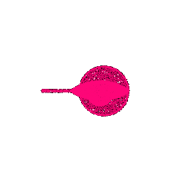
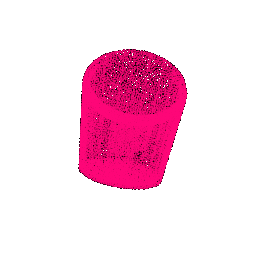
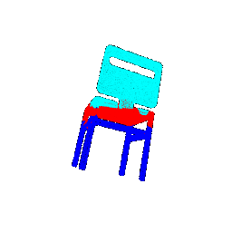

# CMSC848F - Assignment 4: PointNet
## Authors

|Name|ID|Email|
|:---:|:---:|:---:|
|Shantanu Parab|119347539|sparab@umd.edu|

## Description

This package consist of the code and results for the assignment submission for CMSC848F.

**Open [writeup](/report/writeup.md.html) in a browser to access the writeup webpage.**

**Setup**

- These instruction assume that you have completed all the installation and setup steps requrired.
- To recreate the results in this assignment, download the package and unzip into a folder.
- Move into the package `assignment4_sparab`.

Extract the dataset from [here](https://drive.google.com/file/d/1wXOgwM_rrEYJfelzuuCkRfMmR0J7vLq_/view?usp=sharing) and move it into the data folder.


# Classification Model       

- In this section I created a neural network architecture for the classfication task. We computed the accuracy of the model on the test data.


## Test accuracy

We got the best model after training accuracy for 250 epochs.
To compute the accuracy we used the entire test data in bacthes of size 8 and number of points as 10000.

**Test Accuracy: 97.9%**

**Command:**

For training
```bash
python train.py --task cls
```
For testing
```bash
python eval_cls.py --task cls
```

**Results**

**Correctly Classified Instances**

| Point Cloud                                     | Predicted Class | Ground Truth Class|
| :---:                                           |    :----:   |   :---: |
|    | Chair       | Chair   |
|    | Vase        | Vase    |
|    | Lamp        | Lamp    |

**Incorrectly Classified Instances**

| Point Cloud                                     | Predicted Class | Ground Truth Class|
| :---:                                           |    :----:   |   :---: |
|    | Chair        | Lamp    |
|    | Vase        | Lamp    |
|    | Lamp       | Vase   |

## Interpretation


The classification model generally performs well in distinguishing between the three different classes. Nonetheless, there are instances where it makes mistakes and misclassifies objects. This is particularly noticeable with lamps and vases, where the model tends to get confused. The similarity in the geometry of lamps and vases in various instances seems to be the primary reason behind these occasional misclassifications.

# Segmentation

- In this section I created a neural network architecture for the segmentation task. We computed the accuracy of the model on the test data.


## Test accuracy

We got the best model after training accuracy for 250 epochs.
To compute the accuracy we used the entire test data in bacthes of size 8 and number of points as 10000.

**Test Accuracy: 90.26%**

**Command:**

For training
```bash
python train.py --task seg
```
For testing
```bash
python eval_seg.py --task seg
```

**Results**

**Correctly Segmented Instances**

| Ground Truth Point Cloud                                     | Segmented Point Cloud |
| :---:                                                        |   :---: |
|    |         | 
|    |         | 
|    |         | 


**Incorrectly Segmented Instances**

| Ground Truth Point Cloud                                     | Segmented Point Cloud |
| :---:                                                        |   :---: |
|    |         | 
|    |         | 

## Interpretation


The segmentation model demonstrates strong performance in accurately identifying and delineating different parts of chairs. However, there are instances where the model faces challenges and fails to segment parts effectively. This is particularly evident when the chairs have densely packed and overlapping components. In the visualizations provided above, we observe densely packed sofas with parts that overlap


# Robustness Analysis

Inorder to analyse the robustness of the model I conducted 2 experiments.

1. Rotation: Rotated the input point clouds to vary from small rotations to very high rotations around X, Y and Z axis.

2. Number of Points: Varied the number of sample points from extremely low to maximum.

## Classification

### Rotation

| Rotation | Test Accuracy | Correct Prediction | Incorrect Prediction |
| :---:    |    :----:     |    :---:           |    :---:             |
| X: 15 Y: 15 Z: 15 | 91.50%        ||
| X: 45 Y: 45 Z: 45 | 66.11%        ||
| X: 90 Y: 60 Z: 0 |  29.59%        ||

### Number of Points

| Number of Points | Test Accuracy | Correct Prediction | Incorrect Prediction |
| :---:    |    :----:     |    :---:           |    :---:             |
| 10000 | 97.90%        ||
| 5000 | 97.69%        ||
| 1000 | 97.80%        ||
| 100 | 88.56%        ||
| 50 | 66.42%        ||


## Segmentation

### Rotation

| Rotation | Test Accuracy |Ground Truth | Segmentation |
| :---:    |    :----:     |    :---:    |      :---:   |
| X: 15 Y: 15 Z: 15 | 74.26%        ||
| X: 45 Y: 45 Z: 45 | 51.05%        ||
| X: 90 Y: 60 Z: 0 | 28.23%        ||


### Number of Points


| Number of Points | Test Accuracy | Ground Truth| Segmentation |
| :---:    |    :----:     |    :---:           |    :---:             |
| 10000 | 90.25%        |||
| 5000 | 90.25%         |||
| 1000 | 89.95%         |||
| 100 | 82.42%          |||
| 50 | 78.90%           |||

## Analysis

From our experiments, we noticed that changing the number of points in a point cloud affects how well our classification and segmentation model works. When we reduce the number of points, the model doesn't do as well in predicting things correctly during testing. This happens because having fewer points means losing important information that the model needs to make accurate predictions. It's like taking away pieces of a puzzle – without all the pieces, it's harder for the model to understand the whole picture.

Also, when we rotate the point clouds too much, our model's performance drops. This is because our model learns best when the data has specific orientations during training. If we rotate the data too much during testing, the model struggles because it hasn't seen those extreme rotations before. It's like if you learned how to recognize a cat in one position, but then you were asked to recognize it upside down – it might be challenging because you haven't practiced that before. So, the model doesn't do as well on rotated samples because it hasn't learned how to handle those situations.

# References

Inorder to completed the assignment and to understand the code implementation I have used the following References.

Point Net -> https://arxiv.org/abs/1612.00593

<!-- Markdeep: --><style class="fallback">body{visibility:hidden;white-space:pre;font-family:monospace}</style><script src="markdeep.min.js" charset="utf-8"></script><script src="https://morgan3d.github.io/markdeep/latest/markdeep.min.js?" charset="utf-8"></script><script>window.alreadyProcessedMarkdeep||(document.body.style.visibility="visible")</script>


